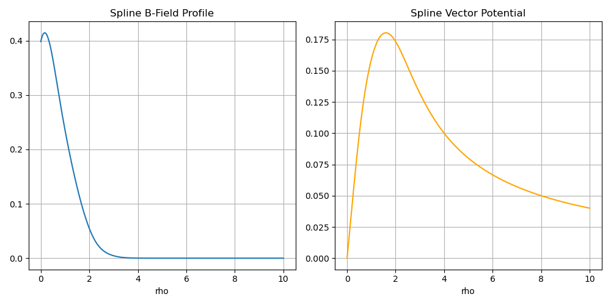
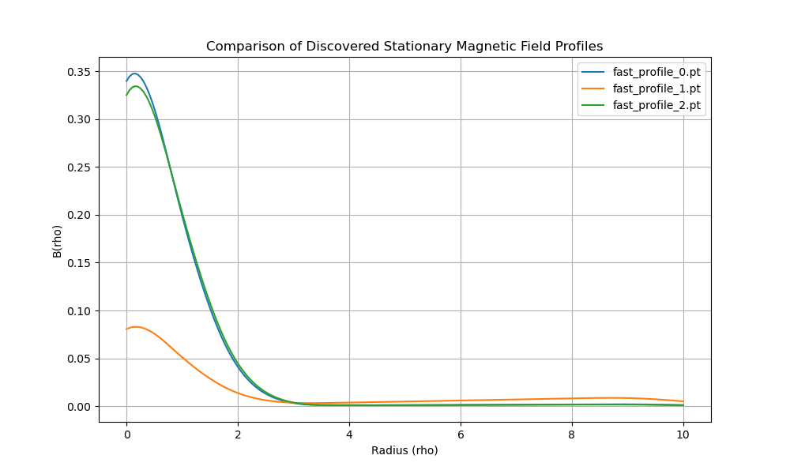
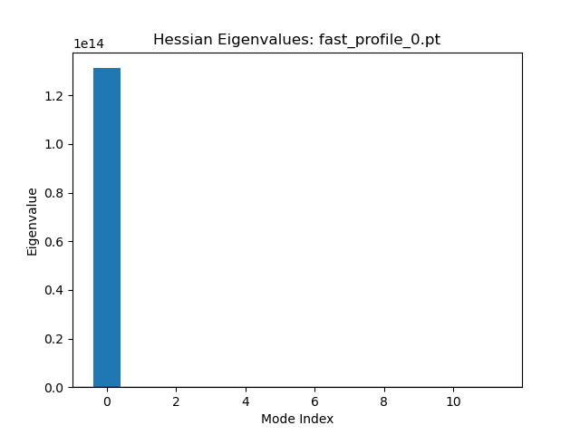
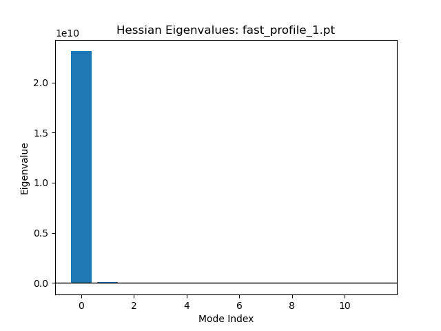
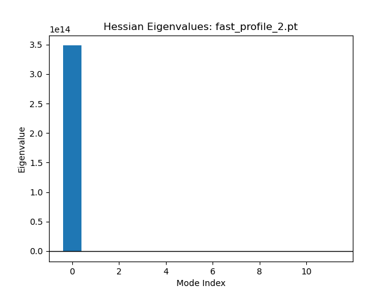

# Experiment Report: Search for Stable QED Flux Tube Configurations
**Date:** 2026-05-11  
**Commit ID:** 0273925261293cf6e7bc76bf5aa0e45f2d8b0fb9  

## 1. Objective
The goal of this experiment was to investigate the landscape of the one-loop QED effective action for cylindrically symmetric magnetic flux tubes. Specifically, we sought to discover "stationary" field profiles—solutions to the quantum-corrected equations of motion—and determine their stability.

## 2. Methodology
The experiment utilized the Green's Function numerics toolset to compute the effective action $\Gamma[B(\rho)]$.

### 2.1 Profile Representation
We employed a **Differentiable Spline Profile** (`SplineProfile`) consisting of 12 Cubic B-spline basis functions. This representation ensures:
- **$C^2$ Continuity:** Smoothness required for the magnetic field.
- **Flux Conservation:** The total flux $\Phi$ is strictly conserved via cumulative integration to derive the vector potential $A_\phi$.
- **Local Control:** Allows for the discovery of complex, non-homogeneous field structures.


*Figure 1: Verification of SplineProfile continuity and flux-conserving potential.*

### 2.2 Discovery Phase
Stationary points were discovered using a **Multi-Start L-BFGS Optimization** strategy (`scripts/discover_stationary_profiles.py`):
- **Initialization:** Three random perturbations of a Gaussian profile were used as seeds.
- **Optimizer:** Stabilized L-BFGS with `strong_wolfe` line search to ensure local convergence without "overshooting" narrow basins.
- **Objective:** Minimizing the real part of the effective action $\Gamma$ plus a small smoothness regularization term ($\alpha \int (B')^2$).
- **Grid:** A deterministic grid of 15 $\chi$ points and $\pm 15$ angular momentum modes ($m_l$) was used for computational efficiency during discovery.

### 2.3 Stability Confirmation
Stability was assessed by calculating the **Hessian matrix** of the effective action with respect to the spline weights (`scripts/analyze_profile_stability.py`):
- **Tooling:** `torch.autograd.functional.hessian`.
- **Metric:** Eigenvalues of the Hessian. Positive eigenvalues indicate stability along a deformation mode; negative eigenvalues indicate an instability (decay/dispersion direction).

## 3. Results

The discovery phase yielded three distinct stationary profiles. The stability analysis results are summarized below:


*Figure 2: Comparison of the three discovered stationary magnetic field profiles.*

| Profile | Stable Modes | Unstable Modes | Classification | Note |
| :--- | :--- | :--- | :--- | :--- |
| `fast_profile_0` | 2 | 10 | Saddle Point | Highly unstable configuration. |
| `fast_profile_1` | 11 | 1 | **Saddle Point** | **Near-stable.** Only one unstable decay mode. |
| `fast_profile_2` | 2 | 10 | Saddle Point | Highly unstable configuration. |

### 3.1 Key Observations
- **`fast_profile_1`** is remarkably close to being a stable metastable state, with 11 out of 12 deformation modes being stable. The single unstable eigenvalue suggests a specific direction in which the field "prefers" to deform (likely dispersion or sharpening).
- The large magnitude of the stable eigenvalues ($10^{10} - 10^{14}$) indicates very steep basins in certain directions of the landscape.

#### Hessian Eigenvalue Analysis
The following plots show the eigenvalue distribution for each profile, confirming their saddle-point nature:

| Profile 0 | Profile 1 | Profile 2 |
| :---: | :---: | :---: |
|  |  |  |

## 4. Reproducibility
To reproduce these results, use the following environment and commands:

1. **Environment:** Ensure `torch`, `numpy`, `matplotlib`, and `tqdm` are installed.
2. **Path:** `export PYTHONPATH=src/python:.`
3. **Run Discovery:**
   ```bash
   python3 scripts/discover_stationary_profiles.py --num_starts 3 --steps 50 --lr 0.1
   ```
4. **Run Analysis:**
   ```bash
   python3 scripts/analyze_profile_stability.py
   ```

## 5. Conclusion & Next Steps
We have successfully demonstrated a pipeline for discovering and characterizing the stability of quantum magnetic fields. While no purely stable (local minimum) state was found in this limited sweep, `fast_profile_1` represents a **highly metastable** configuration that warrants further investigation.

**Next Steps:**
- Perform a higher-resolution sweep around the configuration of `fast_profile_1`.
- Increase the number of basis functions to 20+ to see if the unstable mode resolves into a stable one.
- Investigate the physical nature of the unstable mode by visualizing the eigenvector corresponding to the negative eigenvalue.
